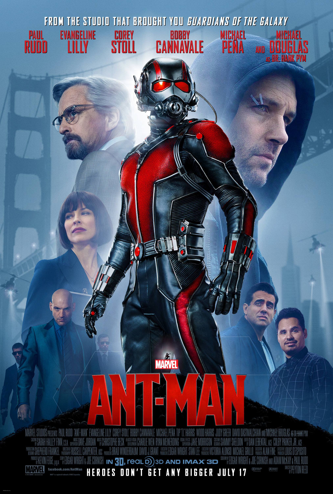

<h1 align="center">
    <a href="https://umpontoseis.com/" target="_blank">
      
    </a>
</h1>

<h1 align="center">
    
</h1>

<h4 align="center">
  🚀 umpontoseis - Marvel Heroes API
</h4>

<p align="center">
  

  
  
  <a href="https://github.com/WallysonGalvao/umpontoseis-marvel-api/commits/master">
    
  </a>

  <a href="https://github.com/WallysonGalvao/umpontoseis-marvel-api/issues">
    
  </a>

  
</p>

<p align="center">
  <a href="#-projeto">Projeto</a>&nbsp;&nbsp;&nbsp;|&nbsp;&nbsp;&nbsp;
  <a href="#rocket-tecnologias">Tecnologias</a>&nbsp;&nbsp;&nbsp;|&nbsp;&nbsp;&nbsp;
  <a href="#rocket-executando">Executando</a>&nbsp;&nbsp;&nbsp;|&nbsp;&nbsp;&nbsp;
  <a href="#rocket-executando">Enpoints</a>&nbsp;&nbsp;&nbsp;|&nbsp;&nbsp;&nbsp;
  <a href="#memo-licença">Licença</a>
</p>
<br>

## 💻 Projeto

Esse projeto é uma api simples com dados mockados disponibilizados em um .json pela **[umpontoseis](https://umpontoseis.com/)** para o projeto Marvel Heroes.

Marvel Heroes é o segundo projeto da **[umpontoseis](https://umpontoseis.com/)** criado de designers para desenvolvedores. A ideia do aplicativo é apresentar personagens do universo Marvel, em uma interface simples, elegante e com alto padrão.

Você pode utilizar a seguinte URL para conhecer melhor o projeto: [Visualizar](https://www.figma.com/community/file/849367817302905364)

## :rocket: Tecnologias

Esse projeto foi desenvolvido com as seguintes tecnologias:

- [Node](https://nodejs.org/)
- [Express](https://expressjs.com/pt-br/)
- [imagemin](https://github.com/imagemin/imagemin)

\* Para mais detalhes, veja o <kbd>[package.json](./package.json)</kbd>

## :notebook: Executando

```bash
# Clone este repositório
$ git clone https://github.com/WallysonGalvao/umpontoseis-marvel-api.git

# Acesse a pasta do projeto no seu terminal/cmd
$ cd umpontoseis-marvel-api

# Instale as dependências
$ yarn install

# Execute a aplicação
$ yarn start

# Acessar http://localhost:3333
```

## :orange_book: Endpoints

- **`/`**: Lista todos os heróis, vilões, anti-vilões e humanos.

```json
[
  {
    "id": 1,
    "category": "heroes",
    "name": "Homem Aranha",
    "alterEgo": "Peter Parker",
    "imagePath": "chars/spider-man.png",
    "biography": "Em Forest Hills, Queens, Nova York, o estudante de ensino médio, Peter Parker, é um cientista orfão que vive com seu tio Ben e tia May. Ele é mordido por uma aranha radioativa em uma exposição científica e adquire a agilidade e a força proporcional de um aracnídeo. Junto com a super força, Parker ganha a capacidade de andar nas paredes e tetos. Através de sua habilidade nativa para a ciência, ele desenvolve um aparelho que o permitir lançar teias artificiais. Inicialmente buscando capitalizar suas novas habilidades, Parker cria um traje e, como Homem Aranha, torna-se uma estrela de televisão.",
    "caracteristics": {
      "birth": "1990",
      "weight": {
        "value": 78,
        "unity": "kg"
      },
      "height": {
        "value": 1.8,
        "unity": "meters"
      },
      "universe": "Terra 616"
    },
    "abilities": {
      "force": 70,
      "intelligence": 65,
      "agility": 90,
      "endurance": 60,
      "velocity": 80
    },
    "movies": [
      "movies/captain-america-3.jpg",
      "movies/spider-man-homecoming.jpg",
      "movies/avengers-3.jpg",
      "movies/avengers-4.jpg",
      "movies/spider-man-far-from-home.jpg"
    ]
  }
]
```

- **`/chars/<image_name>`**: Mostra a imagem do personagem. Ex. http://localhost:3333/chars/spider-man.png
  <p>Ex. http://localhost:3333/chars/spider-man.png

<p align="center">
    
</p>

- **`/movies/<image_name>`**: Mostra a imagem da capa de um filme.
   <p>Ex. http://localhost:3333/movies/ant-man.jpg
</p>
<p align="center">
    
</p>

## :construction: Como contribuir para o projeto

1. Faça um **fork** do projeto.
2. Crie uma nova branch com as suas alterações: `git checkout -b my-awesome-feature`
3. Salve as alterações e crie uma mensagem de commit contando o que você fez: `git commit -m "feature: My awesome feature"`
4. Envie as suas alterações: `git push origin my-awesome-feature`
   > Caso tenha alguma dúvida confira este [guia de como contribuir no GitHub](https://github.com/firstcontributions/first-contributions)

## :memo: Licença

Esse projeto está sob a licença MIT. Veja o arquivo [LICENSE](LICENSE.md) para mais detalhes.

---

Feito com horas em frente ao :computer: por [Wallyson Galvão](https://www.linkedin.com/in/wallyson-galvao/)
